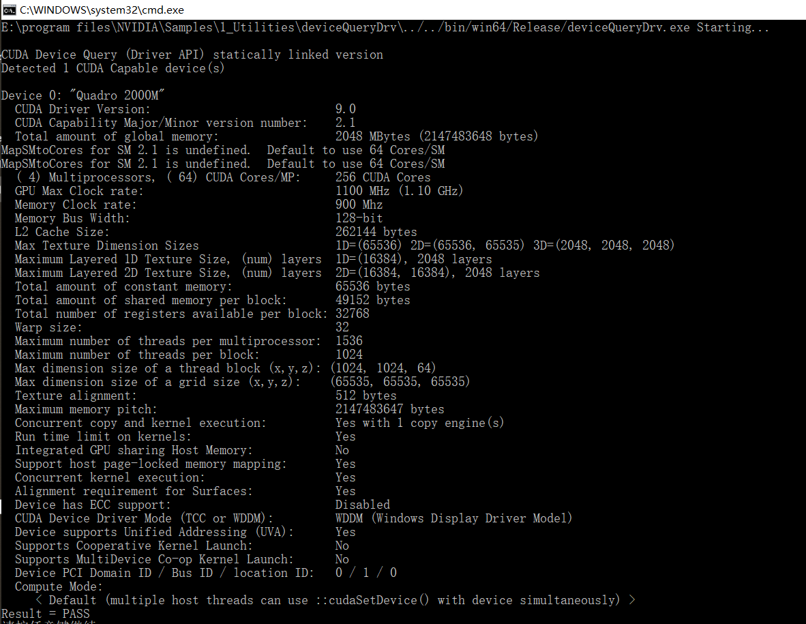
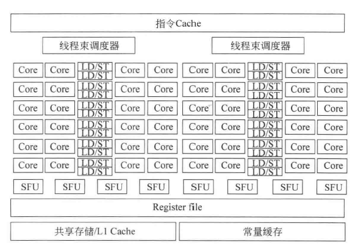
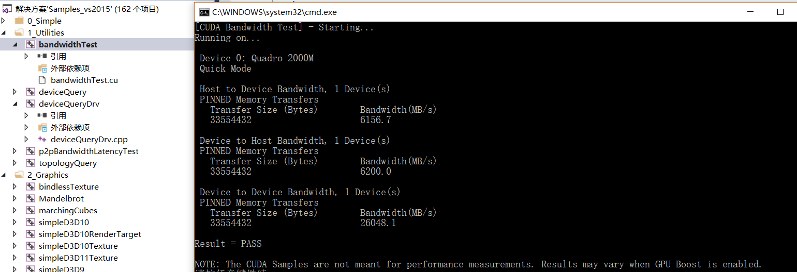

# about-gpu

## GPU显卡参数

* CUDA Capability Major/Minor version number(计算能力)：2.1
  * GPU计算能力不仅仅代表计算的能力，同时它也代表硬件架构上的差异，本显卡属于Fermi架构SM2.1
  * Fermi架构介绍
    * SM2.1，如图：
    
    
    * 正式出现核的概念（core，之前都是使用sp），增加了双精度运算和完整32位整型运算的支持
    * 原子操作做了巨大改进
    * 增加了ECC内存校验
    * 多kernel函数并发执行
    * 共享存储可配置（16KB或48KB）
    * 双warp调度机制
